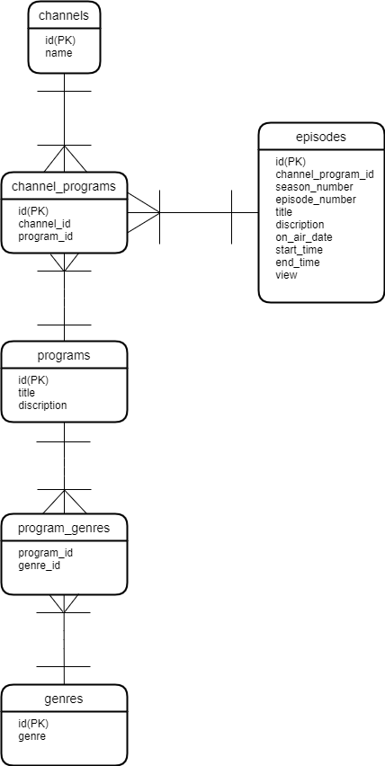

# インターネットTVサービスを作ろう！

好きな時間に好きな場所で話題の動画を無料で楽しめる「インターネットTVサービス」を新規に作成することになりました。データベース設計をした上で、データを取得する SQL を作っていきましょう！


## 目次

1. 要件定義
    - 要件定義とは
    - 要件定義すべき要素
    - 仕様の確認

2. 論理設計
    - エンティティとは
    - エンティティの抽出
    - エンティティの定義
    - 正規化
    - ER図

3. 物理設計
    - データベース構築
    - テーブル定義
    - サンプルデータの格納

4. データの取得(MySQL)

<br>

## 1. 要件定義

### (1) 要件定義とは

  プロジェクトやシステムの開発を達成するために、「何が必要か」を明文化することを、「要件定義」と言います。（チームで開発する際に特に重要！）


### (2) 要件定義すべき要素

  ここでは、3つ紹介します。(プロジェクトやシステムの目的によって、要素は異なります！)

- 機能要件
  - システムの機能や操作の説明に関する要件
    - ○○機能がどのように動作するか
    - ユーザーがどのように操作するか　など

- 非機能要件
  - システムの性能や品質に関する要件
    - 性能目標(レスポンス速度など)
    - セキュリティ要件
    - 使いやすさ　など

- **データ要件**　←　※今回はココ！
  - システムが管理・処理するデータに関する要件
    - データの種類
    - 保存方法
    - データベースの構造　など


###  (3) 仕様の確認

　今回作成する「インターネットTV」の仕様は、以下の通りです。

- ドラマ1、ドラマ2、アニメ1、アニメ2、スポーツ、ペットなど、```複数のチャンネル```がある
- 各チャンネルの下では```時間帯ごとに番組枠が1つ設定```されており、番組が放映される
- 番組は```シリーズ```になっているものと```単発```のものがある。シリーズになっているものは```シーズンが1つ```のものと、```シーズン1、シーズン2のように複数シーズン```のものがある。```各シーズンの下では各エピソードが設定```されている
- ```再放送```もあるため、```ある番組が複数チャンネルの異なる番組枠で放映される```ことはある
- 番組の情報として、```タイトル、番組詳細、ジャンル```が画面上に表示される
- 各エピソードの情報として、```シーズン数、エピソード数、タイトル、エピソード詳細、動画時間、公開日、視聴数```が画面上に表示される。```単発```のエピソードの場合は```シーズン数、エピソード数は表示されない```
- ジャンルとしてアニメ、映画、ドラマ、ニュースなどがある。```各番組は1つ以上のジャンルに属する```
- KPIとして、チャンネルの番組枠の```エピソードごとに視聴数を記録```する。なお、一つのエピソードは複数の異なるチャンネル及び番組枠で放送されることがあるので、属する```チャンネルの番組枠ごとに視聴数がどうだったかも追えるように```する

以上の要件を満たすように、開発を進めていきましょう！


<br>


## 2. 論理設計

### (1) エンティティとは

  「エンティティ(entity)」とは、日本語で実体と訳されます。現実世界に存在するデータを指す言葉です。
  
 例えば、
  - 顧客
  - 社員
  - 店舗
  - 車
  
このような物理的実体をもつものや、

  - 税
  - 会社
  - 注文履歴

このような、単なる概念も含まれます。

データベース設計においては、このようなエンティティを「テーブル」に格納していくことになります。

そのために、まずはどのようなエンティティ(=データ)が必要になるかを抽出していきましょう！（※タスクの一部が要件定義と重なることも多いです）


### (2) エンティティの抽出

  (1)で話したように、仕様を確認しながら、「何をデータとして保存するか」を考えていきます。

【チャンネル】
  - 複数のチャンネルがある
    - ドラマ1
    - ドラマ2
    - アニメ1
    - アニメ2
    - ペット　など
  - 時間帯ごとに1つの番組枠がある

【番組】
  - 番組タイトル
  - 番組の詳細
  - ジャンル
  - 番組の種類
    - 単発番組
      - シーズン数なし
      - エピソード数なし
    - シリーズ番組
      - シーズン数
        - シーズン1
        - シーズン2　など
      - エピソード数
        - 第1話
        - 第2話
      -  エピソードタイトル
          - 「さらばマサラタウン！ 冒険の朝」
          - 「いでよ神龍！ 悟空とハッチャン」
      -  エピソード詳細
      -  公開日
      -  視聴数
         - 視聴数はエピソードごとに
         - 再放送の分も追えるように

【ジャンル】
  - 各番組は1つ以上のジャンルに属する
    - アニメ
    - ドラマ
    - 映画　など

ここまでで、「【チャンネル】【番組】【ジャンル】というテーブルは必要となりそうだ」と見当を付けることができます。


### (3) エンティティの定義
  次に、各エンティティがどのような情報を保持するのかを決めていきます。データベース設計では、各テーブルがどのような「列」を持つか、ということを定義するのがここでの作業です。

  そこで、まずは(2)で抽出したデータを、**全部１つのテーブルに**まとめて、列を作って見てみましょう！

※チャンネル名や番組名などは、分かりやすいように、仮でデータを入れています。


#### インターネットTVテーブル

| チャンネル名  | 番組名             | 番組の詳細                | 番組のジャンル   | 放送開始日時       | 放送終了日時       | 視聴数 | シーズン番号 | エピソード番号 | エピソードタイトル  | エピソードの詳細                 |
|--------------|---------------------|---------------------------|------------------|--------------------|--------------------|--------|------------|--------------|---------------------|----------------------------------|
| NHHK         | 密着！舞台裏24時    | 舞台裏のドキュメンタリー  | ドキュメンタリー | 2023-01-01 20:00   | 2023-01-01 21:30   | 100    | 1          | 10           | 舞台裏の始まり      | 舞台裏のドキュメンタリーの第1話  |
| NHHK         | 3分buzzｸｯｷﾝｸﾞ       | 料理の新シリーズ          | バラエティ       | 2023-01-02 18:30   | 2023-01-02 19:30   | 150    | 1          | 5            | 新たな挑戦          | 料理の新シリーズの第1話          |
| NHHK         | 3分buzzｸｯｷﾝｸﾞ       | 料理の新シリーズ          | 料理             | 2023-01-02 18:30   | 2023-01-02 19:30   | 150    | 1          | 5            | 新たな挑戦          | 料理の新シリーズの第1話          |
| 目テレ       | 同班 -DOVANT-       | ミステリー要素満載        | ドラマ           | 2023-01-03 21:00   | 2023-01-03 22:30   | 200    | 2          | 15           | 謎解きの冒険        | 同班 -DOVANT-の第1シーズン第1話  |
| 目テレ       | おしゃべり009       | ゲストとのトーク          | トーク           | 2023-01-04 15:00   | 2023-01-04 16:30   | 120    | 1          | 8            | 笑いの時間          | ゲストとのトークの第1話          |
| TBBS         | ﾌﾞﾗｯｼｭﾀﾞｳﾝﾗｲﾌ       | 田舎で展開される物語      | ドラマ           | 2023-01-04 15:00   | 2023-01-04 16:30   | 135    | 1          | 8            | 田舎に帰る          | ﾌﾞﾗｯｼｭﾀﾞｳﾝﾗｲﾌの第1シーズン第1話  |


このように、全部のデータを1つのテーブルに集めることで、重要な問題点に気付いたり、この後の作業をスムーズに進めることができたりします。


### (4) 正規化
  正規化(normalization)とは、エンティティ（テーブル）について、システムでの利用がスムーズに行えるように整理する作業です。特に、データの登録・変更・削除などが整合的に行えるようにすることが重要な目的です。

  では、先ほど作った「インターネットTV」テーブルを見てみると、  気になる箇所がいくつか出てくると思います。それを1つずつ改善していき、より整理された形を目指して正規化していきましょう！

  (2)で見当を付けたように、「チャンネル」と「ジャンル」は別テーブルにすべきです。

  - 同じチャンネル名が複数回登場しているため。
  - ジャンルを複数持つ番組は、「ジャンル」以外のカラムの情報が全く同じものになっているため。 

  それぞれを「チャンネルテーブル」「ジャンルテーブル」に分割することで、オペレーションミスが起きる可能性も減らすことができます。(idについては、後述)


#### チャンネルテーブル

| id | チャンネル名   |
|----|---------------|
| 1  | NHHK          |
| 2  | 目テレ        |
| 3  | TBBS          |


#### ジャンルテーブル

| id | ジャンル        |
|----|-----------------|
| 1  | ドキュメンタリー |
| 2  | 料理            |
| 3  | ドラマ          |
| 4  | トーク          |
| 5  | バラエティ      |


#### 番組テーブル

| 番組名             | 番組の詳細                 | シーズン番号  | エピソード番号 | エピソードタイトル  | エピソードの詳細                | 放送開始日時        | 放送終了日時        | 視聴数 | 
|--------------------|---------------------------|------------|--------------|--------------------|--------------------------------|--------------------|--------------------|--------|
| 密着！舞台裏24時    | 舞台裏のドキュメンタリー   | 1          | 10           | 舞台裏の始まり      | 舞台裏のドキュメンタリーの第1話  | 2023-01-01 20:00   | 2023-01-01 21:30   |100     | 
| 3分buzzｸｯｷﾝｸﾞ       | 料理の新シリーズ          | 1          | 5            | 新たな挑戦          | 料理の新シリーズの第1話          | 2023-01-02 18:30   | 2023-01-02 19:30   | 150    |
| 同班 -DOVANT-       | ミステリー要素満載        | 1          | 1            | 謎解きの冒険1       | 同班 -DOVANT-の第1シーズン第1話  | 2023-01-03 21:00   | 2023-01-03 22:30   | 200    |
| 同班 -DOVANT-       | ミステリー要素満載        | 1          | 2            | 謎解きの冒険2       | 同班 -DOVANT-の第1シーズン第2話  | 2023-01-04 21:00   | 2023-01-04 22:30   | 200    |
| 同班 -DOVANT-       | ミステリー要素満載        | 1          | 3            | 謎解きの冒険3       | 同班 -DOVANT-の第1シーズン第3話  | 2023-01-05 21:00   | 2023-01-05 22:30   | 200    |
| 同班 -DOVANT-       | ミステリー要素満載        | 2          | 1            | 謎解きの冒険4       | 同班 -DOVANT-の第2シーズン第1話  | 2023-01-06 21:00   | 2023-01-06 22:30   | 200    |
| おしゃべり009       | ゲストとのトーク          | 1          | 8            | 笑いの時間          | ゲストとのトークの第1話          | 2023-01-04 15:00    | 2023-01-04 16:30   | 120   |
| ﾌﾞﾗｯｼｭﾀﾞｳﾝﾗｲﾌ       | 田舎で展開される物語       | 1          | 8            | 田舎に帰る          | ﾌﾞﾗｯｼｭﾀﾞｳﾝﾗｲﾌの第1シーズン第1話  | 2023-01-04 15:00   | 2023-01-04 16:30   | 135    |

番組テーブルを見ると、エピソードの分だけ同じ番組名と番組詳細が並んでいるのが分かります。

チャンネル・ジャンルと同じ理由で、番組テーブルから「エピソード」部分を分割してみましょう。


#### 番組テーブル

| id   | 番組名             | 番組の詳細                 |
|------|--------------------|---------------------------|
| 1    | 密着！舞台裏24時    | 舞台裏のドキュメンタリー   |
| 2    | 3分buzzｸｯｷﾝｸﾞ       | 料理の新シリーズ          |
| 3    | 同班 -DOVANT-       | ミステリー要素満載        |
| 4    | 同班 -DOVANT-       | ミステリー要素満載        |
| 5    | 同班 -DOVANT-       | ミステリー要素満載        |
| 6    | 同班 -DOVANT-       | ミステリー要素満載        |
| 7    | おしゃべり009       | ゲストとのトーク          |
| 8    | ﾌﾞﾗｯｼｭﾀﾞｳﾝﾗｲﾌ       | 田舎で展開される物語       |


#### エピソードテーブル
| id   | シーズン番号  | エピソード番号 | エピソードタイトル  | エピソードの詳細                | 放送開始日時        | 放送終了日時        | 視聴数 | 
|------|------------|--------------|--------------------|--------------------------------|--------------------|--------------------|--------|
| 1    | 1          | 10           | 舞台裏の始まり      | 舞台裏のドキュメンタリーの第1話  | 2023-01-01 20:00   | 2023-01-01 21:30   |100     | 
| 2    | 1          | 5            | 新たな挑戦          | 料理の新シリーズの第1話          | 2023-01-02 18:30   | 2023-01-02 19:30   | 150    |
| 3    | 1          | 1            | 謎解きの冒険1       | 同班 -DOVANT-の第1シーズン第1話  | 2023-01-03 21:00   | 2023-01-03 22:30   | 200    |
| 4    | 1          | 2            | 謎解きの冒険2       | 同班 -DOVANT-の第1シーズン第2話  | 2023-01-04 21:00   | 2023-01-04 22:30   | 200    |
| 5    | 1          | 3            | 謎解きの冒険3       | 同班 -DOVANT-の第1シーズン第3話  | 2023-01-05 21:00   | 2023-01-05 22:30   | 200    |
| 6    | 2          | 1            | 謎解きの冒険4       | 同班 -DOVANT-の第2シーズン第1話  | 2023-01-06 21:00   | 2023-01-06 22:30   | 200    |
| 7    | 1          | 8            | 笑いの時間          | ゲストとのトークの第1話          | 2023-01-04 15:00    | 2023-01-04 16:30   | 120   |
| 8    | 1          | 8            | 田舎に帰る          | ﾌﾞﾗｯｼｭﾀﾞｳﾝﾗｲﾌの第1シーズン第1話  | 2023-01-04 15:00   | 2023-01-04 16:30   | 135    |


このように分割することで、それぞれのテーブルの役割を整理することもできました。

- チャンネルテーブル
  - チャンネルに関するデータを管理するテーブル
- ジャンルテーブル
  - 番組のジャンルに関するデータを管理するテーブル
- 番組テーブルは
  - 番組名と番組の詳細を管理するテーブル
- エピソードテーブル
  - シリーズに関する情報を管理するテーブル

一方で、このままではテーブル同士が独立してしまい、「どのチャンネルの、何時から、何の番組が放送されるのか」といった**情報が紐づいていない状態**になってしまっています。これでは、システムが情報を正しく判断できず、データベースの機能自体が損なわれてしまいます。

そこでポイントとなってくるのが、以下の2つです。


### ① 主キーの設定

  主キー(primary key)は、テーブルにおいて**必ず一つ存在**しなければならず、かつ、一つしか存在しません。主キーとは、その値を指定すれば、**必ず1行のレコードを特定できる**ような列の組み合わせのことです。この「1行に特定する」ことを、**「一意に識別する」** という言い方をします。

  - 例えば、チャンネルテーブルやジャンルテーブルにある「id」が、主キーにあたります。


### ②　関数従属性

  関数は、学校で習った y = f (x) という関数と同じです。
  
  xの値が決まればyの値も決まる関係を、**「yはxに従属する」** と言い、データベースでは **{ x } → { y }** と表現します。

  - 例えば、チャンネルテーブルでは、{ id } →　{ チャンネル名 } という関数従属が成立しています。

<br>

では、①と②の視点で見ていきながら、各テーブルを紐づけていきましょう。

「チャンネル」の下に「番組」が放送される仕様なので、チャンネルテーブルと番組テーブルを紐づけます。

しかし、```チャンネルは複数の番組を放送```し、```番組は複数のチャンネルで放送される```ことがあります。これを「多対多」の関係と言い、この関係がある場合、テーブル同士を紐づけることができません。（一意に特定できないため）

そこで、**「中間テーブル」** を作ることで、この問題を解消していきます。

今回は、「チャンネルと番組」「番組とジャンル」の2つに「多対多」の関係が存在するため、中間テーブルを2つ作ります。

#### チャンネル番組テーブル

| id  | チャンネルid | 番組id      | 
|-----|-------------|-------------|
| 1   | 1           | 1           |
| 2   | 2           | 2           | 
| 3   | 2           | 3           | 


#### 番組ジャンルテーブル

| 番組id      | ジャンルid |
|-------------|-----------|
| 1           | 1         |
| 1           | 2         |
| 2           | 2         |

ここまで正規化できれば、第三正規形まで行うことができたはずです。

ここまで長くなってしまったので、正規化のポイントをまとめます。

### 正規化のポイント
- 正規化は、更新時の不都合や不整合を排除するために行う
- 正規化は、主キーや関数従属性を見抜くことで可能となる
- 正規化によって分割されたテーブルは、いつでも元通り（１つのテーブル）に戻せる


### (5) ER図

  正規化によってテーブルを分割・整理していくと、テーブルの数がどんどん増えていきます。すると、それぞれのテーブルがどのような意味を持っていて、テーブル同士がお互いにどういう関係にあるのかを把握しづらくなってしまいます。

  そこで、ER図(Entity-Relationship-Diagram)という、テーブルの意味やテーブル同士の関係を示した図にまとめておくことが大事になります。

  特にチーム開発では、ER図があることで、途中で加わったメンバーなどの理解の助けとなります。

  今回は、私が実際に作ったテーブルのER図（IE表記法）を提示します。

  

  <br>

## 3. 物理設計

### (1) データベース構築

　それでは、「internet_tv」という名前のデータベースを作っていきます。

  MySQLに接続し、以下のようなクエリで、新しいデータベースを作成するように指示します。

```sql
CREATE DATABASE internet_tv ;
```


### (2) テーブル定義

先ほど構築したinternet_tvデータベースを選択します。

```sql
USE internet_tv ;
```

次に、各テーブルを作成するクエリを書きます。

```sql

-- channels テーブル
CREATE TABLE channels (
    id BIGINT(20) PRIMARY KEY,
    name VARCHAR(128) NOT NULL,
    INDEX idx_channels_name (name)
);

-- genres テーブル
CREATE TABLE genres (
    id BIGINT(20) PRIMARY KEY,
    genre VARCHAR(128) NOT NULL,
    INDEX idx_genres_genre (genre)
);

-- programs テーブル
CREATE TABLE programs (
    id BIGINT(20) PRIMARY KEY,
    title VARCHAR(128) NOT NULL,
    description TEXT,
    INDEX idx_programs_title (title)
);

-- channel_programs テーブル
CREATE TABLE channel_programs (
    id BIGINT(20) PRIMARY KEY,
    program_id BIGINT(20),
    channel_id BIGINT(20),
    FOREIGN KEY (program_id) REFERENCES programs(id) ON DELETE CASCADE,
    FOREIGN KEY (channel_id) REFERENCES channels(id),
    INDEX idx_channel_programs_program_channel (program_id, channel_id)
);

-- program_genres テーブル
CREATE TABLE program_genres (
    program_id BIGINT(20),
    genre_id BIGINT(20),
    PRIMARY KEY (program_id, genre_id),
    FOREIGN KEY (program_id) REFERENCES programs(id) ON DELETE CASCADE,
    FOREIGN KEY (genre_id) REFERENCES genres(id),
    INDEX idx_program_genres_program_genre (program_id, genre_id)
);

-- episodes テーブル
CREATE TABLE episodes (
    id BIGINT(20) PRIMARY KEY,
    channel_program_id BIGINT(20),
    season_number INT,
    episode_number INT,
    title VARCHAR(128) NOT NULL,
    description TEXT,
    on_air_date DATE,
    start_time TIME,
    end_time TIME,
    view BIGINT(20),
    FOREIGN KEY (channel_program_id) REFERENCES channel_programs(id),
    INDEX idx_episodes_channel_program (channel_program_id),
    INDEX idx_episodes_view (view DESC),
    INDEX idx_episodes_title (title)
);

```


### (3) サンプルデータの格納

各テーブルに、サンプルデータを入れていきます。

```sql

INSERT INTO channels (id, name) VALUES
(1, 'NHHK'),
(2, '教育'),
(3, 'tvvk'),
(4, '目テレ'),
(5, 'テレビ夕日'),
(6, 'TBBS'),
(7, 'テレ束'),
(8, 'アソテレビ');


INSERT INTO genres (id, genre) VALUES
(1, 'ドラマ'),
(2, 'アニメ'),
(3, 'スポーツ'),
(4, 'バラエティ'),
(5, 'ドキュメンタリー'),
(6, '特番'),
(7, 'コメディ'),
(8, '映画');


INSERT INTO programs (id, title, description) VALUES
(1, '鬼滅の刃', '鬼に家族を殺され、唯一生き残った少年・炭治郎が鬼殺隊に加わり、鬼狩りの旅に挑む姿を描くアクションアニメ。'),
(2, 'ワンピース', '海賊王を目指すルフィと仲間たちが冒険と戦いを繰り広げる、大海を舞台にした冒険活劇アニメ。'),
(3, '進撃の巨人', '巨大な人類食いの巨人との戦いを描く、人類の壮絶な生存戦略と謎解きが絡むダークファンタジーアニメ。'),
(4, '同班 -DOVANT-', '日本の公安と警察を舞台にした犯罪ドラマです。物語は、公安と警察の同班で働くエージェントたちが、様々な犯罪やテロに立ち向かいながら、協力して事件を解決していく様子を描いています。作品は緊迫感あるシーンや戦略的な展開、キャラクターたちの複雑な心情描写などを通じて、視聴者を引き込みます。また、日本の法執行機関や治安維持に焦点を当てつつ、社会問題や倫理的なジレンマにも触れながら、犯罪との戦いに挑む人々の姿勢や信念も描かれています。'),
(5, 'ファーストマン ―丸見えの一般人―', '舞台を現代の都市に置いた感動的なドラマです。物語は、普通の一般人が自分の生活に迫り、それによって引き起こされる様々な人間ドラマに焦点を当てています。プロットは、主人公である普通の一般人が、ある日突然自分の生活がテレビドラマとして放送されることを知るところから始まります。彼や彼女は普段の生活から特定の瞬間、家族や友情、仕事など、ありとあらゆる瞬間をカメラで捉えられることになります。'),
(6, 'ブラッシュダウンライフ', '都市の喧威から離れた小さな町で繰り広げられる、人々の人生と感動的な物語が交錯するドラマです。物語は、忙しい現代社会に疲れ果てた主人公が、偶然たどり着いた静かな町で新しい生活を始めるところから始まります。そこは大都市の喧威から離れ、様々な個性豊かな人々が平和に共存する特別な場所です。'),
(7, '女王様に注ぐ粉薬', '陽気で笑い溢れるコメディドラマで、王室の一端を舞台にしています。物語は、古風で格式ある王室で、ある日突然現れた奇妙な薬をめぐる出来事から始まります。この薬は、何者かによって女王様に注がれ、それが原因で周囲の人々が予測不能なふるまいを見せるという奇妙な効果があると言われています。'),
(8, '世界の果てまでモルック', 'このスポーツ番組は、モルックと呼ばれるフィンランド発祥の非常に独特なアウトドアゲームを取り上げています。プログラムでは、世界中の異なる国や地域を訪れ、その土地ごとに異なるモルックのプレイスタイルや変種を紹介しています。'),
(9, 'しゃべくりカバディ', '新感覚のスポーツエンターテインメント番組で、毎回、有名なスポーツアスリートや芸能人たちがスタジオに集結し、特製のカバディコートでカバディ対決に挑みます。しかし、ただの対決ではなく、プレイヤーたちは試合中にも笑いとトークを忘れず、視聴者を楽しませることに重点を置いています。'),
(10, '全力！脱力クリケット', '毎回、プロのクリケット選手や芸能人たちが特設のフィールドに登場し、通常のクリケットとは一味違うルールで競技します。ルールは奇抜であり、たとえばボールが風船仕掛けで転がる、バットが変わり種など、予測不可能な状況がプレイヤーたちを笑いと驚きに包み込みます。'),
(11, '炎のセパタクローTV', '興奮と熱狂が交錯する新感覚のスポーツエンターテインメント番組です。この番組は、セパタクローと呼ばれる独自のスポーツを中心に、プレイヤーたちの情熱と技巧を視聴者に届けます。'),
(12, 'ロバ息子', 'ユニークな設定とキャラクターが織り成す笑いと感動のアニメ作品です。物語は、普通の人間として生まれたのになぜかロバの特徴を持つ主人公・ユウキが繰り広げる不思議でユニークな冒険を描いています。'),
(13, '押忍の子', '古き良き武道の精神を胸に秘めた少年・押忍一郎が、日常のさまざまな問題や困難に立ち向かいながら成長していく姿を描くアクションコメディアニメです。'),
(14, '破滅のヤバい', '破滅的な状況に立ち向かう個性的なキャラクターたちが繰り広げるダークヒーローアクションアニメです。主人公と仲間たちが運命に立ち向かい、彼らの個性や力を駆使して破滅を防ぐ壮絶な冒険が描かれます。'),
(15, 'ツーピース', 'ファッションと青春をテーマに掲げたアニメで、主人公がツーピースと呼ばれる特別なアイテムを通じて成長し、友情や恋愛を育む感動的な冒険が繰り広げられます。'),
(16, '新春！箱根駅弁', '新年を迎えるにあたり、美味しい駅弁と箱根の風光明媚な景色を堪能する旅番組です。司会者たちは箱根の名所巡りとともに、地元の美味しい駅弁を食べ歩きながら、視聴者に新春の癒しと美味しさを届けます。'),
(17, 'SDGs-1グランプリ', 'SDGsにフォーカスを当て、持続可能な社会への取り組みを促進するための特別なイベントです。様々な分野で活躍するプロフェッショナルたちが、持続可能な未来に向けてのアイディアやプロジェクトを競い合います。'),
(18, '紅白蓋合戦', 'エンターテインメント番組で、紅白に別れて激しい対決を繰り広げます。様々なゲストや有名人たちが、蓋を使った個性豊かな競技やパフォーマンスで視聴者を楽しませます。'),
(19, '12時間テレビ', '12時間にわたり様々なエンターテインメントをお届けする長時間特番です。様々なジャンルのコンテンツやイベントが織り交ぜられ、視聴者を飽きさせないユニークな番組構成が特徴です。'),
(20, '映画SHOW', '懐かしい映画や人気の映画を放送します');


INSERT INTO channel_programs (id, channel_id, program_id) VALUES
(1, 1, 18),
(2, 2, 17),
(3, 3, 11),
(4, 4, 6),
(5, 4, 8),
(6, 4, 9),
(7, 4, 16),
(8, 4, 19),
(9, 4, 20),
(10, 5, 1),
(11, 5, 13),
(12, 6, 3),
(13, 6, 4),
(14, 6, 5),
(15, 7, 12),
(16, 7, 14),
(17, 7, 15),
(18, 8, 2),
(19, 8, 7),
(20, 8, 10),
(21, 2, 18),
(22, 3, 17);


INSERT INTO program_genres (program_id, genre_id) VALUES
(1, 2),
(2, 2),
(3, 2),
(4, 1),
(5, 1),
(6, 1),
(7, 1),
(8, 4),
(8, 7),
(9, 3),
(9, 4),
(10, 3),
(10, 7),
(11, 3),
(11, 5),
(12, 2),
(13, 2),
(14, 2),
(15, 2),
(16, 5),
(16, 6),
(17, 5),
(17, 6),
(17, 7),
(18, 6),
(19, 4),
(19, 6),
(20, 8);


INSERT INTO episodes (id, channel_program_id, season_number, episode_number, title, description, on_air_date, start_time, end_time, view)
VALUES
(1, 10, 1, 1, '鬼殺隊の結成', '鬼に家族を襲われた少年・炭治郎が鬼殺隊への入隊を果たす', '2024-01-01', '18:00:00', '18:30:00', 2000),
(2, 10, 1, 2, '山の鬼の襲撃', '炭治郎と仲間たちが山で鬼との激闘に挑む', '2024-01-08', '18:00:00', '18:30:00', 2500),
(3, 10, 1, 3, '剣と水の修行', '炭治郎が剣術と水の修行に挑戦し力を付けていく', '2024-01-15', '18:00:00', '18:30:00', 2500),
(4, 10, 2, 1, '隣の鬼殺隊', '炭治郎が新たな仲間と出会い、ともに鬼との戦いに挑む', '2024-01-22', '18:00:00', '18:30:00', 3000),
(5, 10, 2, 2, '鬼殺隊の使命', '鬼殺隊がさらなる任務に挑む中、炭治郎は自らの過去と向き合う', '2024-01-29', '18:00:00', '18:30:00', 5000),
(6, 10, 2, 3, '闘志の結束', '炭治郎と仲間たちの結束が試される戦いが始まる', '2024-02-05', '18:00:00', '18:30:00', 7000),
(7, 18, 1, 1, '航海の始まり！仲間たちとの出会い', 'モンキーDルフィが海賊王を目指し、仲間たちと出会う冒険の始まり', '2024-01-07', '09:00:00', '09:30:00', 3000),
(8, 18, 1, 2, '海賊狩りのゾロ', '海賊狩りと呼ばれる男ソロとルフィの出会い', '2024-01-14', '09:00:00', '09:30:00', 3000),
(9, 18, 1, 3, '激突！バギー一味', '海賊バギー一味の脅威に立ち向かうルフィとゾロ', '2024-01-21', '09:00:00', '09:30:00', 3500),
(10, 18, 2, 1, '厳しい航海と新たな仲間', 'ルフィと仲間たちが新たな冒険者たちと出会い、ともに冒険を進める', '2024-01-28', '09:00:00', '09:30:00', 3000),
(11, 18, 2, 2, 'グランドラインへの挑戦', 'グランドラインへの挑戦が始まり、新たな敵との戦いが繰り広げられる', '2024-02-04', '09:00:00', '09:30:00', 2500),
(12, 18, 2, 3, '革命の島と伝説の宝', '革命の島にたどりついたルフィたちは、伝説の宝を求めて冒険を始める', '2024-02-11', '09:00:00', '09:30:00', 3000),
(13, 18, 3, 1, '海賊同盟と四皇の脅威', 'ルフィが新たな鎌田と同盟を結び、四皇の脅威に立ち向かう', '2024-02-18', '09:00:00', '09:30:00', 4000),
(14, 18, 3, 2, '革命軍の動きと大海賊団', '革命軍の陰謀と大海賊団の動きが交錯する', '2024-02-25', '09:00:00', '09:30:00', 5000),
(15, 18, 3, 3, '謎の島と新たな世界', '謎の島で新たな冒険者たちとの出会いが待っている', '2024-02-25', '09:30:00', '10:00:00', 5000),
(16, 12, 1, 1, '巨人襲来', '巨人が襲来し、壁内の人々は恐怖に見舞われる', '2024-01-07', '22:30:00', '23:00:00', 4800),
(17, 12, 1, 2, '見えざる者たち', 'エレンと仲間たちが見えざる巨人との戦いに挑む', '2024-01-14', '22:30:00', '23:00:00', 5200),
(18, 12, 1, 3, '壁の中の少年', '訓練兵団でのエレンの過酷な日々と新たな仲間たちとの出会い', '2024-01-21', '22:30:00', '23:00:00', 4400),
(19, 12, 2, 1, '謎の巨人化能力', '謎の巨人化能力者が登場し、壁内に動揺が広がる', '2024-01-28', '22:30:00', '23:00:00', 4000),
(20, 12, 2, 2, '鎧の巨人', '新たな巨人の脅威に立ち向かう長沙兵団', '2024-02-04', '22:30:00', '23:00:00', 3500),
(21, 12, 2, 3, '進撃の真実', '進撃の巨人と壁の謎が明らかになる', '2024-02-11', '22:30:00', '23:00:00', 3000),
(22, 13, 1, 1, '出会いの舞台 - Prologue -', '主人公たちは偶然の出会いを果たし、同班としての絆が芽生える。しかし、それは新たな冒険の始まりに過ぎなかった。', '2024-01-04', '21:00:00', '23:00:00', 4500),
(23, 13, 1, 2, '裏切りの影(初回1時間SP)', '同班内で信じていた仲間が裏切り者として姿を現し、緊張感が高まる。主人公たちは裏切り者の正体を暴くために立ち上がる。', '2024-01-11', '21:00:00', '22:00:00', 4000),
(24, 13, 1, 3, '交わる運命', '運命的な出会いが主人公たちを繋ぎ、共通の敵と直面する。同班のメンバーは協力し、事件の核心に迫る。', '2024-01-18', '21:00:00', '22:00:00', 4100),
(25, 13, 2, 1, '深まる謎', '事件の裏に隠された深い謎が浮かび上がり、同班メンバーは追加の情報を求めて行動する。しかし、それには高いリスクが伴う。', '2024-01-25', '21:00:00', '22:00:00', 4200),
(26, 13, 2, 2, '連鎖する事件', '一連の事件が連鎖的に発展し、同班は時間との闘いに巻き込まれる。解決しなければならない事件の数々が彼らを試す。', '2024-02-01', '21:00:00', '22:00:00', 4100),
(27, 13, 2, 3, '狙われた同班', '同班が犯罪組織や敵対勢力に狙われ、彼らの絆が試される。危険な中、信頼と連携が生死を分ける。', '2024-02-08', '21:00:00', '22:00:00', 4400),
(28, 14, 1, 1, 'オープニングの扉', '主人公が新たな冒険に踏み出し、視聴者にそのドアの向こうに広がる世界を紹介します。', '2024-01-02', '21:00:00', '22:00:00', 4500),
(29, 14, 1, 2, '街の中のひとしずく', '街の中の様々な人々が、小さな幸せや感動を共有する瞬間が描かれます。', '2024-01-09', '21:00:00', '22:00:00', 4500),
(30, 14, 1, 3, '夢中で、でも真剣に', '主人公が夢に向かって真剣に努力する姿勢と、その中で生じる喜びや苦悩が描かれます。', '2024-01-16', '21:00:00', '22:00:00', 4500),
(31, 4, 1, 1, '新しい始まり', '主人公が新しい街での生活を始め、初めての出会いや挑戦に立ち向かいます。', '2024-01-02', '21:00:00', '22:00:00', 4000),
(32, 4, 1, 2, 'カラフルな友情', '主人公が異なる背景を持つ仲間たちと出会い、共に冒険し、友情が芽生えます。', '2024-01-09', '21:00:00', '22:00:00', 3300),
(33, 4, 1, 3, '失われた日々', '過去の出来事が主人公を襲い、彼が失ったものと向き合うエピソード。', '2024-01-16', '21:00:00', '22:00:00', 3600),
(34, 4, 2, 1, '笑顔の奥に', '主人公が周囲に見せない本当の気持ちに向き合い、仲間たちと共に成長していくエピソード。', '2024-01-23', '21:00:00', '22:00:00', 4500),
(35, 4, 2, 2, '未知の扉', '街に隠された謎や新しいチャレンジに挑む主人公と仲間たちの物語。', '2024-01-30', '21:00:00', '22:00:00', 4600),
(36, 4, 2, 3, '共鳴の響き', '仲間たちとの絆が深まり、共鳴する心の響きが描かれる感動的なエピソード。', '2024-02-06', '21:00:00', '22:00:00', 4800),
(37, 19, 1, 1, '王室の騒動はじまる！', '王室に謎の粉薬が届き、女王様がその影響を受ける。宮廷の人々は奇妙な出来事に慌ただしくなり、王室内に笑いあり、混乱ありの騒動が巻き起こる。', '2024-01-01', '21:00:00', '22:00:00', 3000),
(38, 19, 1, 2, '愛と奇薬の効果', '粉薬の効果で愛の告白や奇妙な恋模様が宮廷に広がる。王室のメンバーたちは恋に翻弄され、笑いとロマンスが交錯する。', '2024-01-08', '21:00:00', '22:00:00', 3100),
(39, 19, 1, 3, '王室の秘密暴露！', '粉薬の影響で王室の秘密が次々と明るみに出る。宮廷の人々は予測不能な行動をとり、笑いとサプライズが連続する。', '2024-01-15', '21:00:00', '22:00:00', 3000),
(40, 5, NULL, NULL, 'モルックで一番盛り上がるのはどの瞬間！？', 'このスポーツ番組は、モルックと呼ばれるフィンランド発祥の非常に独特なアウトドアゲームを取り上げています。プログラムでは、世界中の異なる国や地域を訪れ、その土地ごとに異なるモルックのプレイスタイルや変種を紹介しています。', '2024-01-07', '20:00:00', '21:00:00', 1500),
(41, 6, NULL, NULL, 'トークを止めずにカバディに勝利せよ！', '新感覚のスポーツエンターテインメント番組で、毎回、有名なスポーツアスリートや芸能人たちがスタジオに集結し、特製のカバディコートでカバディ対決に挑みます。しかし、ただの対決ではなく、プレイヤーたちは試合中にも笑いとトークを忘れず、視聴者を楽しませることに重点を置いています。', '2024-01-07', '22:00:00', '23:00:00', 3500),
(42, 20, NULL, NULL, '今晩のクリケットは！？', '毎回、プロのクリケット選手や芸能人たちが特設のフィールドに登場し、通常のクリケットとは一味違うルールで競技します。ルールは奇抜であり、たとえばボールが風船仕掛けで転がる、バットが変わり種など、予測不可能な状況がプレイヤーたちを笑いと驚きに包み込みます。', '2024-01-13', '22:30:00', '23:30:00', 3000),
(43, 3, NULL, NULL, 'セパタクローの魅力', '興奮と熱狂が交錯する新感覚のスポーツドキュメンタリー番組です。この番組は、セパタクローと呼ばれる独自のスポーツを中心に、プレイヤーたちの情熱と技巧を視聴者に届けます。', '2024-01-07', '10:00:00', '12:00:00', 1200),
(44, 15, 1, 1, 'ロバの誕生', 'ユウキがロバの特徴を持つことがわかり、彼の新たな生活がスタートする。', '2024-01-07', '9:00:00', '9:30:00', 6000),
(45, 15, 1, 2, 'ロバの学校デビュー', 'ユウキが学校に登場し、クラスメートとのふれあいが始まる。しかし、彼の特異な姿にクラスは騒然となる。', '2024-01-14', '9:00:00', '9:30:00', 4100),
(46, 15, 1, 3, '友情の芽生え', 'ユウキが特異性を乗り越え、真の友情が芽生える。仲間たちとの絆が深まっていく。', '2024-01-21', '9:00:00', '9:30:00', 3800),
(47, 11, 1, 1, '押忍の始まり', '一郎が武道の道を歩み始めるきっかけとなる出来事が起こり、彼の冒険が始まる。', '2024-01-06', '18:00:00', '18:30:00', 2800),
(48, 11, 1, 2, '友情の絆', '一郎が新たな仲間たちと出会い、彼らとの友情が試される。', '2024-01-13', '18:00:00', '18:30:00', 4500),
(49, 11, 1, 3, '押忍合宿', '一郎と仲間たちが武道の合宿に参加し、厳しい修行と笑い溢れるエピソードが繰り広げられる。', '2024-01-20', '18:00:00', '18:30:00', 3100),
(50, 16, 1, 1, '破滅の予感', '主人公たちが破滅の兆候を感じ、それに立ち向かうための準備を始める。', '2024-01-07', '8:30:00', '9:00:00', 2800),
(51, 16, 1, 2, 'ヤバい仲間たち', '主人公が個性豊かな仲間たちと出会い、彼らと共にヤバい状況に立ち向かっていく。', '2024-01-14', '8:30:00', '9:00:00', 2400),
(52, 16, 1, 3, '破滅の謎', '破滅の原因や背後にいる勢力についての謎が明らかになりつつ、主人公たちは真相に迫る。', '2024-01-21', '8:30:00', '9:00:00', 2700),
(53, 17, 1, 1, 'ツーピースの謎', '主人公が偶然手に入れたツーピースには、何か特別な力が秘められていることがわかる。', '2024-01-07', '8:00:00', '8:30:00', 3300),
(54, 17, 1, 2, '新たなる風', 'ツーピースを身にまとった主人公が街を歩くと、周囲に新しい風が吹き始める。', '2024-01-14', '8:00:00', '8:30:00', 4200),
(55, 17, 1, 3, 'ツーピースに選ばれし者', '主人公がツーピースを纏うことで、選ばれし者としての役割が彼に与えられる。', '2024-01-21', '8:00:00', '8:30:00', 5000),
(56, 7, NULL, NULL, '新春！箱根駅弁2024', '新年を迎えるにあたり、美味しい駅弁と箱根の風光明媚な景色を堪能する旅番組です。司会者たちは箱根の名所巡りとともに、地元の美味しい駅弁を食べ歩きながら、視聴者に新春の癒しと美味しさを届けます。', '2024-01-05', '10:00:00', '12:00:00', 4400),
(57, 2, NULL, NULL, 'SDGs-1グランプリ2024', 'SDGsにフォーカスを当て、持続可能な社会への取り組みを促進するための特別なイベントです。様々な分野で活躍するプロフェッショナルたちが、持続可能な未来に向けてのアイディアやプロジェクトを競い合います。', '2024-01-26', '18:00:00', '22:00:00', 3800),
(58, 1, NULL, NULL, '紅白蓋合戦2024', 'エンターテインメント番組で、紅白に別れて激しい対決を繰り広げます。様々なゲストや有名人たちが、蓋を使った個性豊かな競技やパフォーマンスで視聴者を楽しませます。', '2024-01-01', '18:00:00', '23:45:00', 6000),
(59, 8, NULL, NULL, '12時間テレビ2024', '24日間にわたり様々なエンターテインメントをお届けする長時間特番です。様々なジャンルのコンテンツやイベントが織り交ぜられ、視聴者を飽きさせないユニークな番組構成が特徴です。', '2024-01-28', '8:00:00', '20:00:00', 5500),
(60, 9, NULL, NULL, '映画SHOW', '懐かしい映画や人気の映画を放送します', '2024-01-12', '21:00:00', '23:00:00', 5000),
(61, 22, NULL, NULL, 'SDGs-1グランプリ2024(再)', 'SDGsにフォーカスを当て、持続可能な社会への取り組みを促進するための特別なイベントです。様々な分野で活躍するプロフェッショナルたちが、持続可能な未来に向けてのアイディアやプロジェクトを競い合います。', '2024-02-02', '10:00:00', '14:00:00', 3500),
(62, 21, NULL, NULL, '紅白蓋合戦2024(再)', 'エンターテインメント番組で、紅白に別れて激しい対決を繰り広げます。様々なゲストや有名人たちが、蓋を使った個性豊かな競技やパフォーマンスで視聴者を楽しませます。', '2024-01-15', '10:00:00', '15:45:00', 4500);

```

<br>

## 4. データの取得(MySQL)

最後に、作成したテーブルを使って、以下のデータを取得するクエリを書いていきましょう！

(1)よく見られているエピソードを知りたいです。エピソード視聴数トップ3のエピソードタイトルと視聴数を取得してください

```sql
SELECT title, view
  FROM episodes
ORDER BY view DESC
LIMIT 3;
```

<br>

(2)よく見られているエピソードの番組情報やシーズン情報も合わせて知りたいです。エピソード視聴数トップ3の番組タイトル、シーズン数、エピソード数、エピソードタイトル、視聴数を取得してください

```sql
SELECT
  p.title,
  e.season_number,
  e.episode_number,
  e.title AS episode_title,
  e.view
FROM
  episodes e
JOIN
  channel_programs cp ON e.channel_program_id = cp.id
JOIN
  programs p ON cp.program_id = p.id
ORDER BY
  e.view DESC
LIMIT 3;
```

<br>

(3)本日の番組表を表示するために、本日、どのチャンネルの、何時から、何の番組が放送されるのかを知りたいです。本日放送される全ての番組に対して、チャンネル名、放送開始時刻(日付+時間)、放送終了時刻、シーズン数、エピソード数、エピソードタイトル、エピソード詳細を取得してください。なお、番組の開始時刻が本日のものを本日方法される番組とみなすものとします

```sql
SELECT 
    c.name AS channel_name,
    CONCAT(CURDATE(), ' ', e.start_time) AS start_datetime,
    CONCAT(CURDATE(), ' ', e.end_time)   AS end_datetime,
    p.title AS program_title,
    e.season_number,
    e.episode_number,
    e.title AS episode_title,
    e.description
FROM channel_programs cp
JOIN channels c ON cp.channel_id = c.id
JOIN programs p ON cp.program_id = p.id
LEFT JOIN episodes e ON cp.id = e.channel_program_id
WHERE e.on_air_date = CURDATE() OR (e.on_air_date IS NULL AND CURDATE() BETWEEN e.start_time AND e.end_time);
```

<br>

(4)ドラマというチャンネルがあったとして、ドラマのチャンネルの番組表を表示するために、本日から一週間分、何日の何時から何の番組が放送されるのかを知りたいです。ドラマのチャンネルに対して、放送開始時刻、放送終了時刻、シーズン数、エピソード数、エピソードタイトル、エピソード詳細を本日から一週間分取得してください

```sql
SELECT 
    c.name AS channel_name,
    CONCAT(DATE_ADD(CURDATE(), INTERVAL 0 DAY), ' ', e.start_time) AS start_datetime,
    CONCAT(DATE_ADD(CURDATE(), INTERVAL 0 DAY), ' ', e.end_time) AS end_datetime,
    e.season_number,
    e.episode_number,
    e.title AS episode_title,
    e.description
FROM channel_programs cp
JOIN channels c ON cp.channel_id = c.id
JOIN programs p ON cp.program_id = p.id
LEFT JOIN episodes e ON cp.id = e.channel_program_id
WHERE c.name = 'ドラマ'
    AND (
        (e.on_air_date BETWEEN CURDATE() AND DATE_ADD(CURDATE(), INTERVAL 7 DAY))
        OR (e.on_air_date IS NULL AND (CURDATE() BETWEEN e.start_time AND e.end_time))
    );
```

<br>

(5)(advanced) 直近一週間で最も見られた番組が知りたいです。直近一週間に放送された番組の中で、エピソード視聴数合計トップ2の番組に対して、番組タイトル、視聴数を取得してください

```sql
SELECT
    p.title AS program_title,
    SUM(e.view) AS total_views
FROM episodes e
JOIN channel_programs cp ON e.channel_program_id = cp.id
JOIN programs p ON cp.program_id = p.id
WHERE e.on_air_date BETWEEN DATE_SUB(CURDATE(), INTERVAL 7 DAY) AND CURDATE()
GROUP BY p.id
ORDER BY total_views DESC
LIMIT 2;
```

<br>

(6)(advanced) ジャンルごとの番組の視聴数ランキングを知りたいです。番組の視聴数ランキングはエピソードの平均視聴数ランキングとします。ジャンルごとに視聴数トップの番組に対して、ジャンル名、番組タイトル、エピソード平均視聴数を取得してください

```sql
SELECT
    g.genre AS genre_name,
    p.title AS program_title,
    ROUND(AVG(e.view)) AS average_views
FROM episodes e
JOIN channel_programs cp ON e.channel_program_id = cp.id
JOIN programs p ON cp.program_id = p.id
JOIN program_genres pg ON p.id = pg.program_id
JOIN genres g ON pg.genre_id = g.id
GROUP BY g.genre, p.title
ORDER BY genre_name, average_views DESC;
```